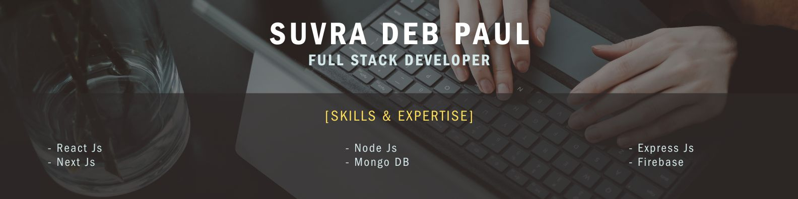

### Full-Stack Developer | Remote-Ready | Passionate about Building Scalable Web Applications

# 👨‍💻 About Me

### Hi there, I'm Suvra Deb Paul 👋

I'm a passionate and dedicated Full stack **MERN** developer with a keen eye for creating efficient, user-friendly, and dynamic web applications. I love tackling complex problems and turning ideas into reality through code. I am currently seeking opportunities to contribute to a talented team and build amazing products.

---

### 🛠️ Tech Stack & Workflow

#### **Frontend**

#### **Backend**

#### **Database & Cloud**

#### **Remote Workflow & Tools**

<!-- 
 -->

---

### 📂 Featured Projects

| Project              | Description                                                                         | Tech Stack                   | Links                         |
| :------------------- | :---------------------------------------------------------------------------------- | :--------------------------- | :---------------------------- |
| **[Project Name 1]** | A full-stack E-Commerce dashboard with payment integration and real-time inventory. | React, Node, MongoDB, Stripe | [**Live**](#) / [**Code**](#) |
| **[Project Name 2]** | Real-time Chat Application allowing users to create rooms and share images.         | React, Socket.io, Express    | [**Live**](#) / [**Code**](#) |
| **[Project Name 3]** | Task Management Tool for remote teams with drag-and-drop functionality.             | Next.js, Firebase, Tailwind  | [**Live**](#) / [**Code**](#) |

---

### 📊 GitHub Analytics

&nbsp;

---

### ✍️ Random Dev Quote

### 🔝 Top Contributed Repo

### 📫 Let's Connect

- **Portfolio Website:** [Link to your portfolio]
- **LinkedIn:** [Link to your profile]
- **Email:** [your.email@example.com]
- **Resume:** [Link to Google Drive PDF or Portfolio]
