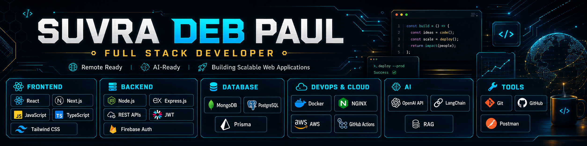

<p align="center">
  
</p>

<h1 align="center">Hi, I'm Suvra Deb Paul 👋</h1>

<h3 align="center">
Full Stack Developer | React | Next.js | Node.js | TypeScript | PostgreSQL | AI-Ready Developer
</h3>

<p align="center">
I build responsive, secure, and scalable web applications using modern JavaScript technologies.
Currently focused on production-level full-stack development, backend architecture, cloud deployment, and AI integration.
</p>

<p align="center">
  <a href="mailto:suvra.deb.paul@gmail.com">
    
  </a>
  <a href="https://linkedin.com/in/suvra-deb-paul/">
    
  </a>
  <a href="https://github.com/SuvraDebPaul">
    
  </a>
  <a href="https://x.com/SuvraDebPaul25">
    
  </a>
</p>

<p align="center">
  
</p>

---

## 👨‍💻 About Me

I am a passionate **Full Stack Web Developer** with hands-on experience in building modern web applications using **React, Next.js, Node.js, Express.js, MongoDB, PostgreSQL, Prisma, Firebase, JWT, REST APIs, and Tailwind CSS**.

I enjoy converting real-world problems into practical software solutions with clean UI, secure backend systems, structured databases, and maintainable code architecture.

I am currently advancing my skills through an **AI-Driven Software Engineering Bootcamp**, where I am learning industry-standard development practices including advanced TypeScript, backend architecture, PostgreSQL, Prisma, authentication, Next.js App Router, Docker, NGINX, AWS, CI/CD, AI API integration, LangChain, RAG, semantic search, and AI automation.

I am open to **remote junior developer roles, internships, freelance projects, and collaboration opportunities**.

---

## 🚀 Current Focus

- Building production-level full-stack applications
- Improving backend architecture and API design
- Learning advanced TypeScript and software engineering principles
- Working with PostgreSQL, Prisma, and relational database modeling
- Creating secure authentication systems with JWT and refresh tokens
- Building Next.js applications with App Router, server actions, and caching
- Exploring AI-powered web applications with LLMs, RAG, and automation
- Practicing Docker, deployment, NGINX, AWS, and CI/CD workflows

---

## 🛠️ Tech Stack

### Frontend Development

<p>
  
  
  
  
  
  
  
  
</p>

### UI & Styling

<p>
  
  
  
  
</p>

### Backend Development

<p>
  
  
  
  
  
  
</p>

### Database & ORM

<p>
  
  
  
  
  
  
</p>

### Authentication, Validation & Security

<p>
  
  
  
  
  
</p>

### AI & Automation

<p>
  
  
  
  
  
  
</p>

### DevOps, Cloud & Deployment

<p>
  
  
  
  
  
  
  
  
</p>

### Tools & Workflow

<p>
  
  
  
  
  
  
  
</p>

---

## 📌 What I Can Build

- Full-stack MERN applications
- Next.js applications with App Router
- REST APIs with Node.js, Express.js, and TypeScript
- Authentication systems with JWT, refresh token, Firebase, and role-based access
- Admin dashboards with analytics, charts, tables, search, filter, sort, and pagination
- PostgreSQL database models with Prisma ORM
- MongoDB applications with Mongoose
- File upload systems using Cloudinary or local storage
- Payment integration with Stripe
- Dockerized full-stack applications
- AI chatbots and AI API-powered features
- RAG-based document question-answering systems
- Remote-ready and maintainable web applications

---

## 📂 Featured Projects

| Project                                          | Description                                                                                                                                                                                                                                                    | Tech Stack                                                                    | Links                 |
| :----------------------------------------------- | :------------------------------------------------------------------------------------------------------------------------------------------------------------------------------------------------------------------------------------------------------------- | :---------------------------------------------------------------------------- | :-------------------- |
| **Public Infrastructure Issue Reporting System** | A role-based citizen issue reporting platform where citizens can report public problems and authorities can manage, assign, track, and resolve issues. Includes authentication, dashboard, search, filtering, pagination, and payment-based priority boosting. | React, Node.js, Express.js, MongoDB, Firebase Auth, JWT, Stripe, Tailwind CSS | [Live](#) / [Code](#) |
| **StudyMate — Find Your Perfect Study Partner**  | A MERN stack student collaboration platform where users can find study partners, create partner profiles, send requests, and filter by subject or experience level.                                                                                            | React, Node.js, Express.js, MongoDB, Firebase, Tailwind CSS, DaisyUI          | [Live](#) / [Code](#) |
| **Real Estate Booking & CRM Platform**           | A real estate consultation and lead management platform with property listing, booking workflow, agent dashboard, admin panel, and lead tracking system.                                                                                                       | Next.js, TypeScript, Node.js, PostgreSQL, Prisma, Tailwind CSS                | [Live](#) / [Code](#) |
| **AI Document Assistant**                        | A document-based AI assistant that allows users to upload documents and ask questions using semantic search and retrieval-augmented generation.                                                                                                                | Next.js, OpenAI API, LangChain, PostgreSQL, pgvector, RAG                     | [Live](#) / [Code](#) |

---

## 📚 Currently Learning

```txt
Advanced TypeScript
Object-Oriented Programming in TypeScript
Node.js and Express.js Architecture
PostgreSQL and Database Design
Prisma ORM
JWT Authentication and Refresh Token Flow
Role-Based Authorization
Global Error Handling
Zod Validation
Next.js App Router
Server Actions
Caching and Revalidation
TanStack Query
TanStack Table
Docker and Docker Compose
NGINX Reverse Proxy
AWS EC2 and S3
GitHub Actions CI/CD
OpenAI API Integration
LangChain
RAG and Semantic Search
n8n AI Automation
Testing with Vitest and Supertest
```

## 📊 GitHub Analytics

<p align="center">
  
</p>

---

## 🐍 GitHub Contribution

<p align="center">
  <picture>
    <source
      media="(prefers-color-scheme: dark)"
      srcset="https://raw.githubusercontent.com/SuvraDebPaul/SuvraDebPaul/output/github-contribution-grid-snake-dark.svg"
    />
    <source
      media="(prefers-color-scheme: light)"
      srcset="https://raw.githubusercontent.com/SuvraDebPaul/SuvraDebPaul/output/github-contribution-grid-snake.svg"
    />
    
  </picture>
</p>

## 🏆 GitHub Trophies

<p align="center">  </p>

## ✍️ Dev Quote

<p align="center">  </p>

## 🤝 Let's Connect

<p>
I am open to remote junior developer roles, internships, freelance projects, and collaboration opportunities.
</p>

<p>
  <a href="mailto:suvra.deb.paul@gmail.com">
    
  </a>
</p>

<p>
  <a href="https://www.linkedin.com/in/suvra-deb-paul/">
    
  </a>
</p>

<p>
  <a href="https://github.com/SuvraDebPaul">
    
  </a>
</p>

<p>
  <a href="https://x.com/SuvraDebPaul25">
    
  </a>
</p>

<p>
  <a href="https://facebook.com/1suvra.deb.paul">
    
  </a>
</p>

<p>
  <a href="https://drive.google.com/file/d/1ds146HIX37hPmcF-6A8k5FfMqWHBxYOt/view?usp=sharing">
    
  </a>
</p>

---

<p align="center">
  <strong>Thanks for visiting my profile!</strong>
</p>

<p align="center">
  I am continuously learning, building, and improving as a developer.
</p>
