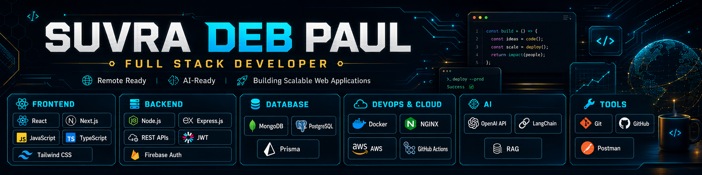

  

<h1 align="center">Hi, I'm Suvra Deb Paul 👋</h1>

<h3 align="center">
Full Stack Developer | React | Next.js | Node.js | TypeScript | PostgreSQL | AI-Ready Developer
</h3>

Full-stack developer building modern websites and SaaS products with React, Next.js, TypeScript, and PostgreSQL. I turn ideas into clean, scalable applications — from business websites to full-fledged SaaS platforms — with a focus on solid architecture, secure authentication, and interfaces that feel effortless to use. I care as much about the product working for the business as it does for the user. Always learning, always shipping.

  
  
  
  

  

---

## 👨‍💻 About Me

I'm a **Full Stack Web Developer** building modern, production-ready web applications with **React, Next.js, TypeScript, Node.js, PostgreSQL, and Prisma**. I focus on clean UI, secure backend systems, and maintainable architecture — turning real-world problems into software that actually ships.

I work independently and communicate clearly in async environments — a habit built from managing real client and business work alongside development, not just coursework.

I'm currently deepening my skills in advanced TypeScript, backend architecture, and the Next.js App Router through hands-on projects, while exploring Docker, cloud deployment, and AI-powered features as I build toward more complex, production-scale systems.

<!-- 📍 Based in Bangladesh (GMT+6) — comfortable with async workflows and flexible overlap hours.

🟢 **Open to:** remote junior/mid full-stack roles, internships, freelance projects, and long-term collaboration. -->

---

## 🚀 Current Focus

- Building and shipping production-level full-stack SaaS applications
- Designing relational database schemas with PostgreSQL and Prisma
- Building secure authentication systems (JWT, refresh tokens, role-based access)
- Working with Next.js App Router — server actions, caching, and data revalidation
- Exploring Docker and cloud deployment for production-ready workflows

---

## 🛠️ Tech Stack

### Programming Languages

## CSS Frameworks & Libraries

## JavaScript Frameworks & Libraries

## Database & ORM

## Authentication & Security

## Deployment Platform

## Design & Graphics

## Tools & Workflow

  

## 📌 What I Can Build

- Full-stack applications with the MERN stack and Next.js (App Router)
- REST APIs with Node.js, Express.js, and TypeScript
- Authentication systems — JWT, refresh tokens, Firebase Auth, role-based access
- Admin dashboards with analytics, charts, tables, search, filter, sort, and pagination
- Relational database models with PostgreSQL and Prisma ORM
- MongoDB applications with Mongoose
- File upload systems using Cloudinary or local storage
- Payment integration with Stripe
- AI-powered features using LLM APIs (chat interfaces, smart automation)
- Business and marketing websites with clean, responsive UI
- Remote-ready, maintainable, production-grade codebases

---

### 📂 Featured Projects

### 🔗 LinkPilot

Campaign link management SaaS for freelancers and agencies — short links, QR codes, click analytics, and client-ready reports. Full-stack Next.js application with a no-login guest shortener, Stripe subscriptions, workspace roles, custom domains, and token-based client portals.

`Next.js 16` `TypeScript` `Prisma` `PostgreSQL` `NextAuth` `Stripe`

### ⚡ Smart Link Management System\*\*

A decoupled rebuild of the same link-management concept — Next.js frontend paired with a standalone Express REST API. Features multi-provider OAuth via better-auth, API-key authentication, real-time analytics, Stripe billing, and scheduled background jobs.

`Next.js` `Express.js` `TypeScript` `MongoDB` `better-auth` `Stripe`

### 🏗️ Public Infrastructure Issue Reporting System\*\*

Full-stack civic platform where citizens report infrastructure issues and municipal staff/admins track them through a complete lifecycle. Role-based dashboards for Citizens, Staff, and Admins, with upvoting, priority-boost payments, and a visual issue timeline.

`React` `Node.js` `Express` `MongoDB` `Firebase Auth` `Stripe`

---

## 📊 GitHub Analytics

    

---

## 🐍 GitHub Contribution

  <picture>
    <source
      media="(prefers-color-scheme: dark)"
      srcset="https://raw.githubusercontent.com/SuvraDebPaul/SuvraDebPaul/output/github-contribution-grid-snake-dark.svg"
    />
    <source
      media="(prefers-color-scheme: light)"
      srcset="https://raw.githubusercontent.com/SuvraDebPaul/SuvraDebPaul/output/github-contribution-grid-snake.svg"
    />
    
  </picture>

## 🏆 GitHub Trophies

  

## ✍️ Dev Quote

  

## 🤝 Let's Connect

I am open to remote junior developer roles, internships, freelance projects, and collaboration opportunities.

  

  

  

  

  

  

---

  <strong>Thanks for visiting my profile!</strong>

  I am continuously learning, building, and improving as a developer.

